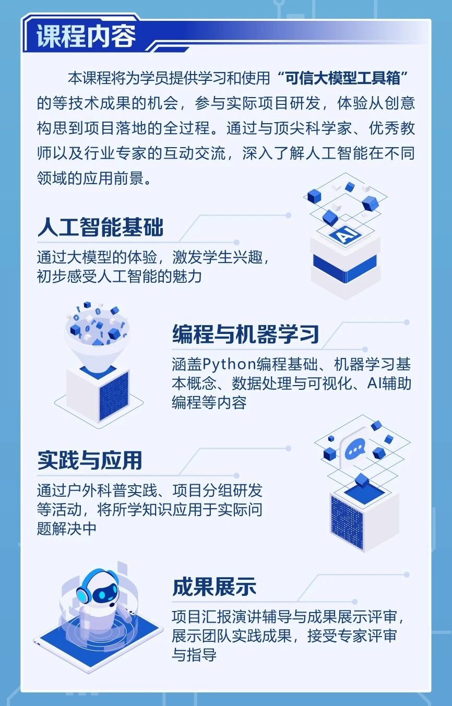
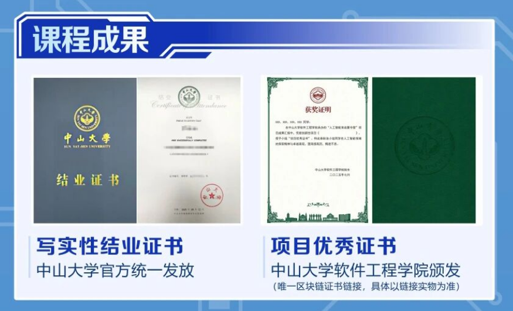
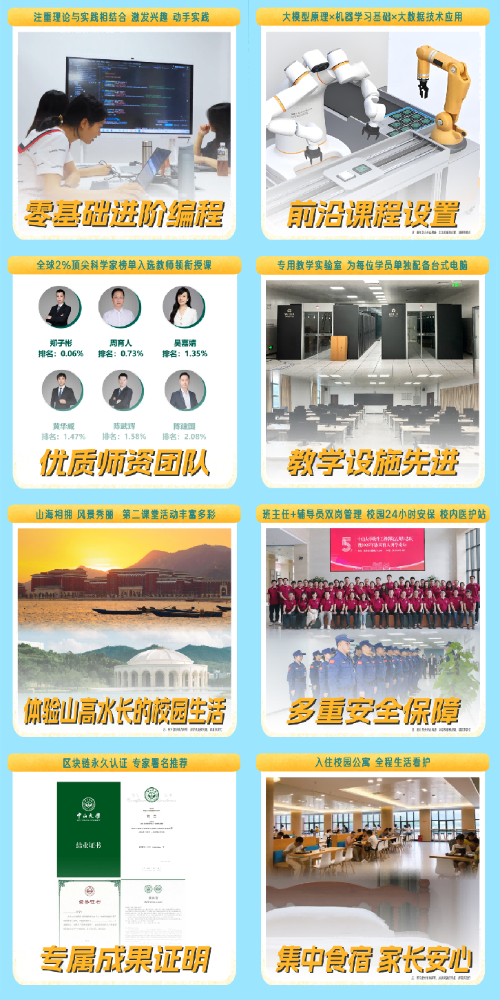
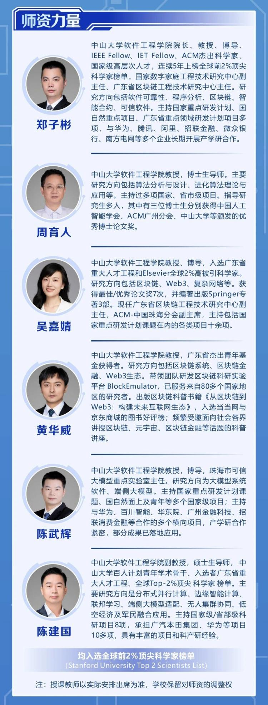

# 中山大学暑期AI夏令营招生代理资料包

## 一、项目核心信息

- **项目全称**：2026中山大学人工智能育苗夏令营
- **项目地点**：中山大学珠海校区（广东省珠海市唐家湾镇大学路2号）
- **课程背景**：为贯彻落实党的二十大提出的"教育强国"战略，响应《教育强国建设规划纲要(2024-2035)》中将人工智能教育列为核心任务的号召，中山大学软件工程学院依托其在人工智能领域的深厚学术底蕴和顶尖师资力量，推出中山大学人工智能夏令营。该项目紧密围绕珠海"科创教育2.0"体系，借助珠澳协同创新高地的优势，为粤港澳大湾区西岸核心城市的中学生提供前沿的人工智能教育体验，推动地区人工智能教育生态的建设与发展。
- **课程优势**：依托学术底蕴、培养复合型人才、推动AI教育普及
- **招生对象**：初一至高三学生（13-18岁）可分组别上课；对人工智能有浓厚兴趣，具备一定的学习能力和创新精神

## 二、代理合作政策

### 2.1 代理权限

授权渠道商在指定区域/群体内，需以中山大学统一输出的海报开展本次中山大学暑期AI夏令营的招生宣传、咨询解答、生源信息收集、报名引导等工作，需严格遵守珠海南标科教技术有限公司及中山大学相关招生规定，不得超出授权范围操作。

### 2.2 市场价

项目统一学费标准：**6800元/人**（对外严格统一市场价）

> 按实际应收学费 6800 元/人为唯一核算基准，不含个人杂费、交通费、食宿外自选消费等其他费用。

### 2.3 代理分成政策

| 招生人数 | 分成比例 | 佣金/人 |
|---------|---------|--------|
| ≤30人 | 7% | 476元/人 |
| ≥30人且＜50人 | 12% | 816元/人 |
| ≥50人且＜70人 | 15% | 1020元/人 |
| ＞70人 | 17% | 1156元/人 |

## 三、核心推广物料

1. 中山大学暑期AI夏令营官方招生简章（PDF版）
2. 宣传海报（高清图）

   

   

   

3. 问卷二维码+邮箱地址 — 直接引导生源完成报名操作

   

## 四、对接人信息

- **联系人**：贾梦楠
- **电话/微信**：15875663729
- **邮箱**：578780927@qq.com
